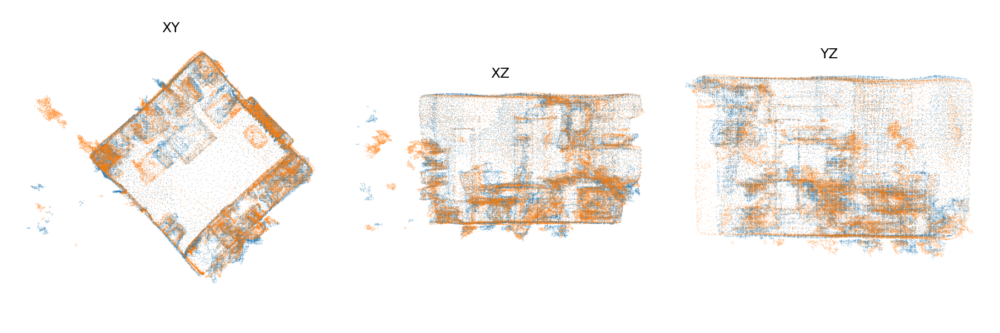
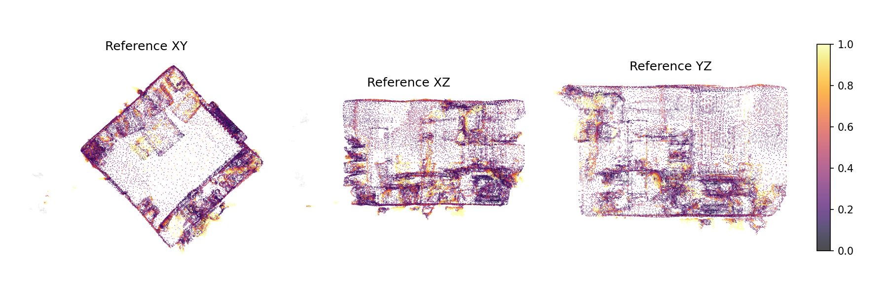

# Multi-session 3D Change Detection Baseline (3RScan)

Geometry-only baseline for detecting object-level changes between two 3D scans of the same indoor environment. Built on [3RScan](https://github.com/WaldJohannaU/3RScan), a dataset of ~1500 RGB-D reconstructions with repeated captures over time.

No GPU needed. Python 3.10+, NumPy, Matplotlib.

<p align="center">
  
</p>
<p align="center"><em>Aligned overlay of a reference scan (blue) and rescan (orange), three orthographic views.</em></p>

<p align="center">
  
</p>
<p align="center"><em>Per-point change heatmap on the reference scan. Inferno = NN distance / tau; gray = unobserved.</em></p>

## Motivation

Most 3D change detection work focuses on learned models that are hard to inspect when they fail. This pipeline takes the opposite approach: every decision is explicit, every intermediate result is saved, and a QC gate tells you upfront when the output shouldn't be trusted. It's a reproducible baseline and a debugging tool, not a state-of-the-art detector.

## How it works

Given a reference scan and a rescan of the same space:

1. **Align** using the metadata transform from `3RScan.json`, with automatic meter/millimeter scale detection
2. **QC gate** — compute overlap ratios; mark the pair as unreliable if overlap is too low
3. **Comparable region** — only report change where both scans actually observe the same area
4. **Change heatmaps** — bidirectional nearest-neighbor distances on voxel-downsampled point clouds
5. **Object attribution** — vote change evidence onto instances via per-point `objectId`, rank by score, assign types: `appeared` / `disappeared` / `moved_rigid` / `nonrigid_or_recon`
6. **Report** — per-pair HTML page with figures + batch summary tables

For the full method description, see [`docs/PROJECT_REPORT.md`](docs/PROJECT_REPORT.md).

## Output structure

Per pair (`outputs/<run>/pairs/<reference>__<rescan>/`):

| File | Contents |
|---|---|
| `qc.json` | Overlap ratios, comparable ratios, reliability verdict |
| `alignment.json` | Applied transform, scale detection details |
| `objects.csv` | Top-K objects with scores, change types, support counts |
| `report.html` + `figures/` | One-page report with overlay, heatmaps, object table |
| `heatmap_ref.ply`, `heatmap_rescan.ply` | Colored point clouds (optional, skippable with `--skip-ply`) |

Per run: `summary.csv` and `summary.md` with weak-label hit rates.

## Reference results (current status)

60 curated pairs from `configs/pairs/showcase.json`: 

- Reliable: 59 / 60 (one intentionally low-overlap pair to test the gate)
- hit@3 = 0.831, hit@5 = 0.983, hit@10 = 1.000 (reliable pairs only)
- Smaller objects are harder to retrieve at low K — expected for a geometry-only baseline with 2 cm downsampling

Details and size-bucket breakdown in [`docs/PROJECT_REPORT.md`](docs/PROJECT_REPORT.md).

## Dataset setup

3RScan is not included. Download it under their [Terms of Use](https://github.com/WaldJohannaU/3RScan) and arrange as:

```
Datasets/
  3RScan.json
  3RScan/
    <scanId>/
      labels.instances.annotated.v2.ply
      semseg.v2.json
      mesh.refined.v2.obj
      mesh.refined.mtl
      mesh.refined_0.png
      sequence.zip
```

The directory is flat by `scanId`; reference/rescan relationships are in `3RScan.json`. Some test-split rescans lack semantic files — object attribution targets train/validation pairs. `objectId == 0` (background) is excluded from Top-K ranking.

Verify your layout:

```bash
python3 scripts/inspect_3rscan.py --datasets-root Datasets --write-smoke-config
```

## Quickstart

```bash
pip install -r requirements.txt
```

**Single pair:**

```bash
python3 scripts/run_pair.py --datasets-root Datasets \
  --pair-config configs/pairs/smoke_pair.local.json \
  --exclude-labels wall,floor,ceiling
```

**Batch from a curated list + summary:**

```bash
python3 scripts/run_batch.py --datasets-root Datasets \
  --pairs-json configs/pairs/featured.json \
  --out-root outputs/featured \
  --exclude-labels wall,floor,ceiling --resume

python3 scripts/make_summary.py --datasets-root Datasets \
  --out-root outputs/featured --write-md
```

Then open `outputs/featured/pairs/<pair_id>/report.html`.

**Auto-select pairs from a split** (ranked by number of weak-label changes):

```bash
python3 scripts/run_batch.py --datasets-root Datasets \
  --split train --limit 20 --resume

python3 scripts/make_summary.py --datasets-root Datasets \
  --out-root outputs --write-md
```

**Reproduce the reference run** (60 pairs):

```bash
python3 scripts/run_batch.py --datasets-root Datasets \
  --pairs-json configs/pairs/showcase.json \
  --out-root outputs/showcase \
  --exclude-labels wall,floor,ceiling --resume

python3 scripts/make_summary.py --datasets-root Datasets \
  --out-root outputs/showcase --write-md
```

## Additional tools

| Script | Purpose |
|---|---|
| `scripts/run_ablation.py` | Sweep `voxel_size x tau`, metrics-only mode |
| `scripts/make_ablation_table.py` | Aggregate ablation results into a comparison table |
| `scripts/make_size_summary.py` | Hit rates bucketed by object size (OBB dimensions) |
| `scripts/make_hero_list.py` | Pick representative report candidates for qualitative review |

Run any script with `--help` for full usage.

## Qualitative examples

[`docs/FEATURED_CASES.md`](docs/FEATURED_CASES.md) shows three pre-selected cases with rendered figures: two reliable pairs with localized changes, and one QC-gated failure.

The HTML reports are committed under `docs/featured_cases/`. Clone the repo and open them locally for the best experience (GitHub renders HTML as source).

## Limitations

- Geometry-only — can't reliably separate real change from reconstruction noise without appearance or semantic cues.
- Weak labels from `3RScan.json` are noisy reference signals, not ground truth.
- No ICP refinement in this baseline.

## Tests

```bash
python3 -m unittest discover -s tests
```

## Citation

If you use 3RScan, please cite:

```bibtex
@inproceedings{wald2019,
    title={RIO: 3D Object Instance Re-Localization in Changing Indoor Environments},
    author={Johanna Wald, Armen Avetisyan, Nassir Navab, Federico Tombari, Matthias Niessner},
    booktitle={Proceedings IEEE International Conference on Computer Vision (ICCV)},
    year = {2019}
}
```
