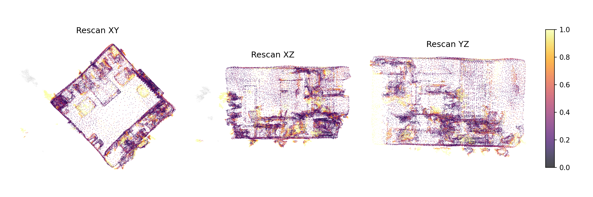
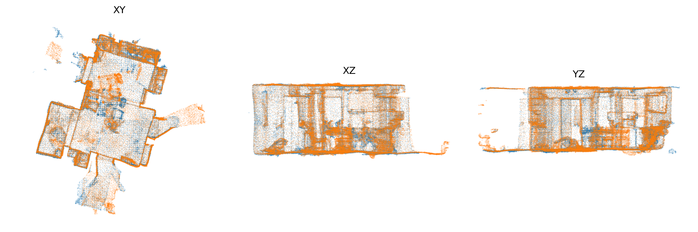
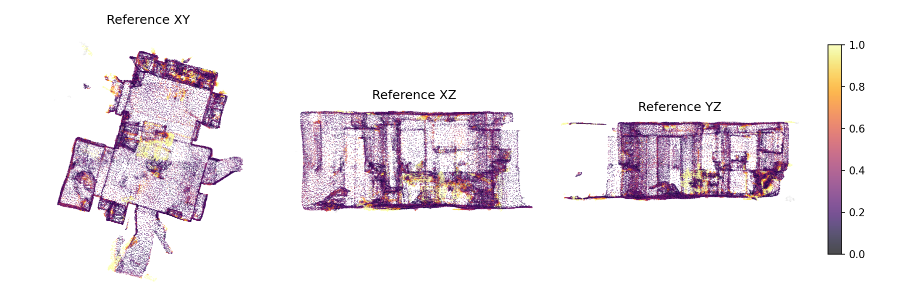
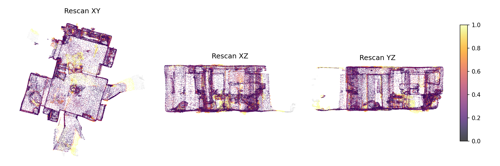
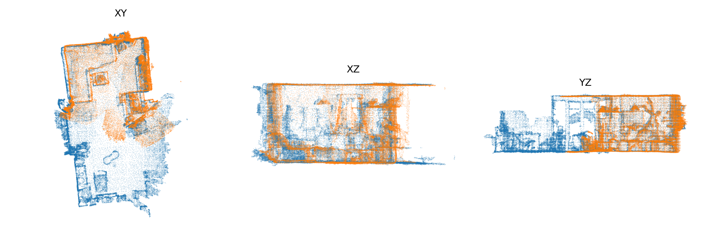
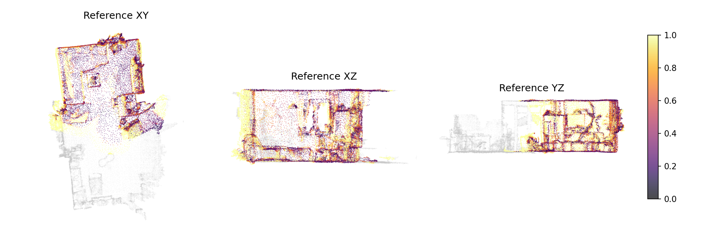
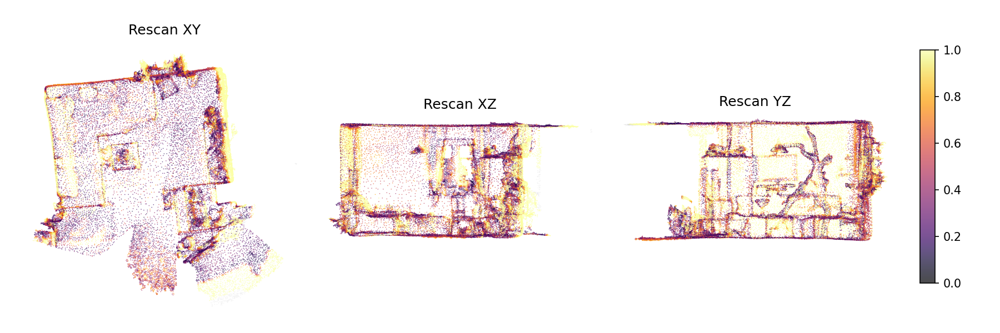

# Featured Cases

Three cases from the pipeline: two reliable pairs with localized changes, and one QC-gated failure. To reproduce locally:

```bash
python3 scripts/run_batch.py --datasets-root Datasets \
  --pairs-json configs/pairs/featured.json \
  --out-root outputs/featured \
  --exclude-labels wall,floor,ceiling --resume
```

The HTML reports are committed under `docs/featured_cases/`. Open them locally after cloning for the interactive version (GitHub renders HTML as source).

---

## Case A: Laundry basket appears, chair moves

A clean reliable pair. The pipeline picks up two distinct changes: a new object and a shifted one.

- **Pair:** `0988ea72-eb32-2e61-8344-99e2283c2728` → `9766cbf7-6321-2e2f-81e1-2b46533c64dd`
- **QC:** overlap gate = 0.703, overlap mean = 0.721, comparable ref / rescan = 0.995 / 0.975
- **Top objects:** `appeared` laundry basket, `moved_rigid` chair
- **Full report:** [report.html](featured_cases/0988ea72-eb32-2e61-8344-99e2283c2728__9766cbf7-6321-2e2f-81e1-2b46533c64dd/report.html)

**Overlay**


**Heatmaps (reference / rescan)**




---

## Case B: Bottle and plant removed

Another reliable pair. Two objects disappear and a chair shifts position.

- **Pair:** `38770ca1-86d7-27b8-8619-ab66f67d9adf` → `38770ca3-86d7-27b8-85a7-7d840ffdec6a`
- **QC:** overlap gate = 0.785, overlap mean = 0.811, comparable ref / rescan = 0.995 / 0.971
- **Top objects:** `disappeared` bottle, `disappeared` plant, `moved_rigid` chair
- **Full report:** [report.html](featured_cases/38770ca1-86d7-27b8-8619-ab66f67d9adf__38770ca3-86d7-27b8-85a7-7d840ffdec6a/report.html)

**Overlay**



**Heatmaps (reference / rescan)**





---

## Failure: Partial overlap triggers QC gate

This pair has poor coverage overlap — the reference scan sees a large region that the rescan misses. Without the QC gate, the pipeline would report many "disappeared" objects that are simply unobserved.

- **Pair:** `280d8ebb-6cc6-2788-9153-98959a2da801` → `4731976c-f9f7-2a1a-95cc-31c4d1751d0b`
- **QC:** overlap gate = 0.246 (threshold = 0.300), overlap mean = 0.344, comparable ref / rescan = 0.602 / 0.994
- **Verdict:** Marked **unreliable**. Outputs are diagnostics only.
- **Full report:** [report.html](featured_cases/280d8ebb-6cc6-2788-9153-98959a2da801__4731976c-f9f7-2a1a-95cc-31c4d1751d0b/report.html)

The asymmetry is visible in the numbers: `comparable_ref = 0.602` means 40% of the reference has no counterpart in the rescan. The overlay shows the mismatch — note the large blue-only regions.

**Overlay**



**Heatmaps (reference / rescan)**




